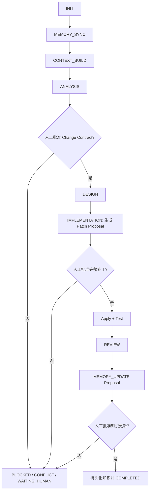

# Frontend Engineering Knowledge Agent Plugin

一个面向长期演进前端项目的 Codex 工程知识插件。

它不把一次开发任务简单处理成“理解需求 → 修改代码 → 结束”，而是把项目约束、业务域知识、功能与缺陷历史、架构决策、代码变更和验证证据组织成可持续维护的工程知识，并通过强制人工审批控制设计、改码和知识写入。

当前版本：`2.1.0`（v2.1 MVP）

## 这个插件解决什么问题

在持续迭代的前端项目中，AI 往往缺少这些上下文：

- 为什么当前架构要这样设计；
- 某个页面、组件或接口曾经发生过什么变更；
- 某个 Bug 的根因和历史修复方式；
- 哪些代码是开发者手工调整过、必须保留的；
- 当前需求会影响哪些功能、路由、状态、接口和测试；
- 一次实现是否已经获得确认，是否可以安全写入长期记忆。

Frontend Engineering Knowledge Agent 在项目仓库内建立一套可审计的知识系统。每次任务先检索与当前目标相关的事实和历史，再生成变更契约、实施计划和补丁提案；开发者确认后才继续下一步。完成评审后，插件只把经过确认的工程含义写回长期知识库。

## 核心能力

| 能力 | 开发者获得什么 |
| --- | --- |
| 项目知识库 | 在 Git 仓库中长期保存项目约束、领域知识、功能、Bug、变更和架构决策 |
| Memory Router | 优先按实体 ID、文件、路由、符号等明确线索检索，再沿结构关系扩展上下文 |
| Task Context | 为单个任务构建最小且可追溯的上下文，减少无关信息干扰 |
| 原型与交互证据门槛 | 用户可见变更必须由用户提供原型及完整点击结果，缺失时阻止进入设计 |
| Feature / Bug / Refactor 分析 | 将需求、缺陷或重构目标转换成可验证的 Change Contract |
| 影响分析 | 识别关联文件、组件、接口、状态、测试、历史变更和风险 |
| 方案设计 | 从已批准的 Change Contract 生成可追踪的 Implementation Plan |
| 提案式实现 | 先生成补丁说明和完整 diff，人工确认后才修改产品代码 |
| 变更保护 | 识别工作区漂移和人工修改，避免静默覆盖开发者已有工作 |
| 工程评审 | 按 P0-P3 输出发现，核对需求、架构、回归面和测试证据 |
| 知识治理 | 使用来源、置信度、验证时间和验证人管理知识可信度 |
| 审批与审计 | 为分析、补丁和知识更新保存明确的审批记录与报告 |
| 状态机控制 | 对任务阶段进行守卫，缺少前置产物或批准时拒绝越级执行 |

## 插件包含什么

本插件当前是一个 **skills-only 插件**，不包含 MCP Server、外部 Connector、浏览器扩展或后台服务。所有知识文件和运行时产物都保存在目标 Git 仓库中。

它提供四个协作阶段：

| Skill | 适用场景 | 主要输出 | 是否修改产品代码 |
| --- | --- | --- | --- |
| `frontend-analysis` | 功能分析、Bug 调查、重构分析、任务接手 | `task-context.yaml`、`change-contract.yaml` | 否 |
| `frontend-design` | 将已批准的分析转换成技术方案 | `implementation-plan.yaml` | 否 |
| `frontend-implementation` | 生成补丁提案、等待确认、应用补丁并验证 | `patch-proposal.yaml`、`patch-proposal.diff`、Change Entity 提案 | 仅在补丁批准后 |
| `frontend-review` | 验收实现、评估回归、检查架构、更新工程知识 | review 报告、`memory-update-proposal.yaml` | 默认不修代码；仅在知识更新批准后写入 memory |

插件还包含一个无第三方 Python 依赖的运行时工具：

```text
frontend-engineering-agent-plugin/scripts/frontend_ai.py
```

四个 Skill 会使用它初始化知识目录、构建上下文、记录审批、推进状态和校验产物。日常使用时，开发者通常只需要向 Codex 描述任务，不必手工调用脚本。

## 工作方式



### 三个人工审批门

1. **Analysis Approval Gate**

   开发者审核 `change-contract.yaml`，确认用户提供的原型、点击后的交互效果、目标、范围、验收标准、影响面、风险、未知项和非目标。用户可见变更缺少可检查的原型或完整交互结果时，契约只能保持 `DRAFT` 并进入 `BLOCKED`；没有明确批准，插件不会进入设计阶段。

2. **Patch Approval Gate**

   插件先生成 `patch-proposal.yaml` 和 `patch-proposal.diff`，但不修改产品文件。开发者审核确切 diff 并明确批准后，插件才应用补丁和运行验证。

3. **Memory Approval Gate**

   评审阶段生成 `memory-update-proposal.yaml`。开发者确认其中的 Feature、Bug、Change、Decision、Domain 或 Project 知识后，插件才更新长期知识库。

原始的“请实现这个需求”不等于补丁批准；沉默、继续对话或已有 `READY` 状态也不视为批准。每个 Gate 都需要明确的人类决定。

## 知识模型与目录

第一次在项目中运行分析时，插件会非破坏性地初始化：

```text
docs/frontend-ai/
├── memory/
│   ├── project/              # 项目级约束与 Constitution
│   ├── domain/               # 业务域知识
│   ├── feature/              # 功能实体与演进历史
│   ├── bug/                  # 缺陷、复现、根因和修复历史
│   ├── change/               # 已确认的工程变更
│   ├── decision/             # 架构与工程决策
│   ├── schema/               # 知识结构定义
│   └── index/                # 实体与关系索引
├── runtime/
│   ├── approvals/            # analysis / patch / memory 审批记录
│   ├── cache/                # 可重建缓存
│   ├── state.yaml            # 当前 Orchestrator 状态
│   ├── task-context.yaml     # 当前任务上下文
│   ├── change-contract.yaml  # 变更契约
│   ├── implementation-plan.yaml
│   ├── patch-proposal.yaml
│   ├── patch-proposal.diff
│   ├── change-entity-proposal.yaml
│   └── memory-update-proposal.yaml
└── reports/
    ├── <task-id>-change-log.md
    └── <task-id>-review.md
```

三个区域的职责不同：

- `memory/` 是经过治理的长期工程知识，适合纳入版本控制；
- `runtime/` 是当前任务的状态、提案和审批证据；
- `reports/` 是便于人类阅读和审计的变更、评审记录。

### 工程实体

| 实体 | 记录内容 |
| --- | --- |
| Project | 技术栈、目录约定、工程原则、全局约束 |
| Domain | 业务概念、规则、边界与关联功能 |
| Feature | 功能行为、入口、依赖、验收和演进历史 |
| Bug | 观察结果、预期结果、复现、根因、修复和回归范围 |
| Change | 一次经过验证的实现变更及其测试证据 |
| Decision | 架构或工程决策、备选方案、理由和后果 |

每条受治理知识可以记录 `source`、`confidence`、`lastVerified` 和 `verifiedBy`。因此，插件会把 memory 当成带有来源和可信度的证据，而不是不可质疑的真相；当仓库事实与历史知识冲突时，会进入 `CONFLICT`，请求开发者判断。

## 安装

### 前置条件

- Codex 桌面端或 Codex CLI；插件目前不支持 Codex IDE 扩展；
- Git；
- Python 3.9 或更高版本，用于运行本地 MVP runtime；
- 一个允许 Codex 读取和修改的前端项目仓库。

### 方式一：从已配置的 Marketplace 安装

如果团队或个人 Marketplace 已经发布了本插件，可以在 Codex 桌面端打开 **Plugins**，找到 **Frontend Engineering Knowledge Agent** 并点击安装。

Codex CLI 也可以安装：

```bash
codex plugin add frontend-engineering-agent-plugin@<marketplace-name>
codex plugin list
```

也可以先运行 `codex`，再输入 `/plugins`，从插件浏览器中选择对应 Marketplace 和插件。

### 方式二：从本仓库进行本地开发安装

先克隆仓库：

```bash
git clone https://github.com/GHjiejie/Frontend-Engineering-Agent-Plugin.git
cd Frontend-Engineering-Agent-Plugin
```

插件源目录不是仓库根目录，而是：

```text
<repository>/frontend-engineering-agent-plugin
```

在 Codex 中使用内置 `$plugin-creator`，将这个绝对路径加入个人 Marketplace 并安装。例如：

```text
Use $plugin-creator to add
/absolute/path/Frontend-Engineering-Agent-Plugin/frontend-engineering-agent-plugin
to my personal marketplace and install it.
```

完成后可以验证：

```bash
codex plugin list
```

如果插件已经存在于名为 `personal` 的 Marketplace，也可以直接执行：

```bash
codex plugin add frontend-engineering-agent-plugin@personal
```

### 方式三：接入团队 Marketplace

Marketplace 仓库需要包含 `.agents/plugins/marketplace.json`，并将本插件目录配置为其中一个 source。开发者先添加团队 Marketplace，再安装插件：

```bash
codex plugin marketplace add <local-marketplace-path-or-owner/repo>
codex plugin add frontend-engineering-agent-plugin@<marketplace-name>
```

关于 Marketplace 的标准结构和发布方式，请参考 [Build plugins](https://developers.openai.com/plugins/build/plugins)。

### 安装后的必要步骤

**安装完成后请新建一个 Codex 任务或 CLI session。** 已安装插件的 Skill 只会在新任务中加载。若仍在安装前打开的任务中继续对话，可能看不到本插件能力。

## 如何使用

### 第一阶段必须提供的设计输入

对于任何会改变用户所见或所做行为的需求，调用 `frontend-analysis` 时必须提供：

- 可检查的原型，例如具体的 Figma 文件、Page、Frame、Node，带标注的图片或线框图；
- 受影响页面或组件在原型中的准确位置；
- 每个按钮、链接、菜单、表单动作或手势触发后的结果；
- 跳转、弹窗、抽屉、提示、状态和数据变化；
- 适用的 loading、success、failure、empty、disabled、permission、validation、cancel/back 和 retry 路径；
- 响应式或不同设备上的差异。

仅提供无法访问的链接不算完成输入；静态原型没有描述点击结果时，也必须补充交互说明。插件不能用 AI 猜测或当前源码替代用户意图。

纯内部重构等完全不改变 UI 和交互的任务可以不提供新原型，但 Change Contract 必须记录不需要原型的理由，以及证明 UI/交互保持不变的仓库证据。

### 触发方式

你可以直接描述任务，让 Codex 根据 Skill 描述自动选择阶段：

```text
请分析用户管理页面新增批量禁用功能会影响哪些组件、接口和测试，
先输出 Change Contract，不要修改代码。
```

也可以显式选择 Skill。安装后，它们通常以插件命名空间显示：

```text
$frontend-engineering-agent-plugin:frontend-analysis
$frontend-engineering-agent-plugin:frontend-design
$frontend-engineering-agent-plugin:frontend-implementation
$frontend-engineering-agent-plugin:frontend-review
```

不同 Codex 客户端可能显示简称。最稳妥的方式是在 Codex CLI 输入 `/skills`，或在桌面端的 Skill 选择器中选择本插件下的对应 Skill。

### 推荐的完整开发流程

以下示例以“为订单列表增加失败任务重试功能”为例。

#### 第 1 步：分析需求

```text
使用 $frontend-engineering-agent-plugin:frontend-analysis 分析：
为订单列表增加失败任务重试功能。
原型：<Figma Frame/Node 链接或已附加原型图>。
交互：点击“重试”后进入 loading；成功后刷新该行状态；失败后保留失败状态并显示错误；
重复点击、无权限和请求超时的处理分别为……。
请检查原型和交互是否完整，读取仓库实现、现有工程知识和历史变更，构建 Task Context，
输出 Change Contract；不要设计方案，也不要修改产品代码。
```

分析阶段会重点产出：

- 目标、非目标和验收标准；
- 原型引用、UI 状态和完整点击交互路径；
- 涉及的页面、组件、路由、API、状态和测试；
- 相关 Feature、Bug、Change 和 Decision；
- 已确认事实、推断、假设和未知项；
- 兼容性、回归、数据、安全和可访问性风险。

审核文件：

```text
docs/frontend-ai/runtime/change-contract.yaml
```

如果内容正确，明确批准：

```text
我已审核 docs/frontend-ai/runtime/change-contract.yaml，
批准 Analysis Gate，请记录批准并进入设计阶段。
```

如果不正确，指出需要修改的条目并拒绝或要求重新分析，不要先批准再修改契约。

#### 第 2 步：设计方案

```text
使用 $frontend-engineering-agent-plugin:frontend-design，
根据已批准的 Change Contract 生成 Implementation Plan。
请说明方案取舍、文件操作、组件和状态边界、接口映射、测试、回滚与知识更新计划。
```

审核文件：

```text
docs/frontend-ai/runtime/implementation-plan.yaml
```

设计阶段不会修改产品代码。即使你认可设计，也不代表自动批准后续补丁。

#### 第 3 步：生成补丁提案

```text
使用 $frontend-engineering-agent-plugin:frontend-implementation，
按照 READY 的 Implementation Plan 生成 Patch Proposal。
先展示完整 diff 并停在 Patch Approval Gate，不要应用补丁。
```

审核文件：

```text
docs/frontend-ai/runtime/patch-proposal.yaml
docs/frontend-ai/runtime/patch-proposal.diff
```

重点检查：

- diff 是否只覆盖已批准范围；
- 实际 UI 和交互是否逐项追踪已批准的原型与点击结果；
- 是否保留当前工作区的人工修改；
- 文件、依赖和实现方式是否与计划一致；
- 是否包含必要的 loading、empty、error、permission、responsive 和 accessibility 状态；
- 测试与回滚是否足够。

确认后明确批准：

```text
我已审核 patch-proposal.yaml 和 patch-proposal.diff，
批准 Patch Gate。请只应用该补丁，然后运行计划中的验证。
```

如果工作区在审批期间发生漂移，插件应停止应用并重新生成提案，而不是把旧补丁强行套到新代码上。

#### 第 4 步：评审与知识更新

```text
使用 $frontend-engineering-agent-plugin:frontend-review，
根据 Change Contract、Implementation Plan、批准的补丁和实际 diff 完成评审。
请运行适用的检查，按 P0-P3 报告发现，并生成 Memory Update Proposal。
```

主要产物：

```text
docs/frontend-ai/reports/<task-id>-review.md
docs/frontend-ai/runtime/memory-update-proposal.yaml
```

评审结果定义：

- `PASS`：没有未解决的 P0-P2，且所有必需标准都有证据；
- `FAIL`：存在确认的阻断缺陷，需要回到 implementation 并重新走补丁审批；
- `BLOCKED`：缺少必要环境或验证证据；
- `WAITING_HUMAN`：需要开发者决定意图或治理内容。

如果知识提案准确，明确批准：

```text
我已审核 docs/frontend-ai/runtime/memory-update-proposal.yaml，
批准 Memory Gate，请只持久化提案中已批准的知识，并完成任务。
```

### 只使用某一个阶段

插件可以在满足前置条件时单独使用：

- 只调查问题：使用 `frontend-analysis`，停在 Analysis Gate；
- 只做方案评审：在已有已批准 Change Contract 时使用 `frontend-design`；
- 对现有实现做最终评审：仅当仓库中存在可追溯的批准补丁和运行时产物时使用 `frontend-review`；
- 发现未经记录的人工变更：先回到 `frontend-analysis`，重新构建上下文和提案。

它不会为了“方便”跳过缺失的审批或伪造运行时产物。

## Runtime CLI 高级用法

日常使用建议让 Skill 管理运行时。维护者、调试人员和自动化脚本可以直接调用：

```bash
python3 frontend-engineering-agent-plugin/scripts/frontend_ai.py --help
```

下列示例都在本仓库根目录执行；`--root` 指向要管理的目标前端项目。

### 初始化知识目录

```bash
python3 frontend-engineering-agent-plugin/scripts/frontend_ai.py \
  init --root /path/to/frontend-project
```

`init` 是非破坏性的，不会覆盖已经存在的知识文件。

### 创建工程实体

```bash
python3 frontend-engineering-agent-plugin/scripts/frontend_ai.py \
  new-entity feature customer-management \
  --root /path/to/frontend-project \
  --title "Customer management" \
  --domain customer

python3 frontend-engineering-agent-plugin/scripts/frontend_ai.py \
  new-entity bug BUG-001 \
  --root /path/to/frontend-project \
  --title "Retry button remains disabled" \
  --domain order
```

支持的实体类型为 `feature`、`bug`、`change` 和 `decision`。命令会同时更新知识索引。

### 构建 Task Context

```bash
python3 frontend-engineering-agent-plugin/scripts/frontend_ai.py \
  context TASK-001 \
  --root /path/to/frontend-project \
  --type bug \
  --goal "Fix retry button disabled state" \
  --domain order \
  --feature order-retry \
  --bug BUG-001 \
  --target src/pages/orders/OrderList.tsx \
  --constraint "Preserve the existing API contract" \
  --non-goal "Do not redesign the order table"
```

`--target`、`--constraint` 和 `--non-goal` 可以重复传入。

### 记录审批

```bash
python3 frontend-engineering-agent-plugin/scripts/frontend_ai.py \
  approval \
  --root /path/to/frontend-project \
  --gate analysis \
  --decision APPROVED \
  --by developer-name \
  --reason "Scope and acceptance criteria confirmed" \
  --evidence docs/frontend-ai/runtime/change-contract.yaml
```

`--gate` 支持 `analysis`、`patch` 和 `memory`；`--decision` 支持 `PENDING`、`APPROVED` 和 `REJECTED`。

请勿用脚本代替真实人工审核。这个命令只负责记录已经发生的决定。

### 推进状态

```bash
python3 frontend-engineering-agent-plugin/scripts/frontend_ai.py \
  state \
  --root /path/to/frontend-project \
  --to ANALYSIS \
  --task-id TASK-001 \
  --reason "Task context is ready"
```

状态转换受前置产物和审批守卫约束。非法跳转会返回非零退出码。

### 验证产物

```bash
python3 frontend-engineering-agent-plugin/scripts/frontend_ai.py \
  validate \
  --root /path/to/frontend-project \
  --phase analysis
```

支持的阶段：

```text
memory
context
analysis
design
patch-proposal
implementation
review
memory-update
```

## 团队落地建议

### 将知识与代码一起评审

建议把 `docs/frontend-ai/memory/` 和有保留价值的 `reports/` 纳入 Git。工程知识的变更应像代码一样经过 diff 和评审，尤其是 Constitution、Decision、Feature 验收行为和 Bug 根因。

是否提交 `runtime/` 取决于团队策略：需要跨任务或跨开发者延续审批链时可以保留；只把它当作本地工作区时，应通过团队统一的 `.gitignore` 规则处理，而不是由插件擅自决定。

### 先维护 Constitution

在首次正式使用前，建议完善：

```text
docs/frontend-ai/memory/project/constitution.yaml
```

适合写入的规则包括：

- 目录和模块边界；
- API 访问层约束；
- 状态管理的生命周期原则；
- 组件复用、设计 Token 和样式规则；
- TypeScript、测试、可访问性和性能基线；
- 禁止覆盖或必须兼容的历史行为。

规则越具体、可验证，设计和评审结果越稳定。

### 使用稳定的实体 ID

建议团队统一命名，例如：

```text
Feature: customer-management
Bug:     BUG-001
Change:  CHG-2026001
Decision: ADR-012
Task:    TASK-2026-001
```

任务描述中主动提供实体 ID、文件路径、路由或符号名称，可以显著提高检索精度。

### 保持最小上下文

本插件不会把整个 memory 无差别注入任务。它优先使用：

1. 明确引用：实体 ID、路径、路由、符号、Feature 或 Bug；
2. 结构关系：Domain、Feature、Bug、Change、Decision 之间的索引关系；
3. 仓库事实：当前源码、测试、配置和 Git 状态。

这能降低旧知识和无关知识对当前决策的干扰。

## 安全边界

- Analysis 和 Design 阶段不修改产品代码；
- Implementation 在 Patch Gate 前只生成提案和 diff；
- Review 默认只报告问题，不会静默修复；
- 长期 memory 只在 Memory Gate 批准后更新；
- 插件不会自动提交、推送、创建 PR 或部署；这些操作需要开发者单独授权；
- 插件运行时仍受 Codex Host 的 sandbox 与 approval policy 约束；
- 插件不连接外部服务，也不会把工程知识发送到自建后端；
- 当证据冲突、审批缺失、环境不足或工作区漂移时，流程应停止而不是猜测。

## v2 MVP 已实现范围

当前版本已经实现：

- v2 知识目录与基础 schema；
- Project、Domain、Feature、Bug、Change、Decision 存储；
- JSON 知识索引；
- 显式检索和结构关系检索；
- Task Context 构建；
- 用户可见变更的原型、点击结果与 UI 状态硬门槛；
- Change Contract、Implementation Plan、Patch Proposal、Review 与 Memory Proposal 工作流；
- 三个人工审批记录；
- Orchestrator 状态守卫；
- 分阶段产物校验；
- 对旧版目录的非破坏性识别。

当前版本尚未实现：

- Embedding、向量数据库或语义检索；
- 自动 Git History 同步；
- 自动架构漂移检测；
- 后台守护进程或远程知识服务；
- v1 知识的自动迁移；
- 自动提交、推送、PR 或部署。

这些能力属于后续阶段。当前 MVP 在输出中不应声称已经执行了语义检索或自动同步。

## 常见问题

### 安装后为什么找不到 Skill？

确认 `codex plugin list` 中插件已安装并启用，然后新建一个 Codex 任务或 CLI session。也可以使用 `/skills` 查找插件下的四个 Skill。

### 为什么 Design 不继续？

检查：

```text
docs/frontend-ai/runtime/approvals/analysis.yaml
```

它必须包含明确的 `APPROVED`。`change-contract.yaml` 的 `READY` 不等于人工批准。

### 为什么 Implementation 只生成 diff，没有修改代码？

这是预期行为。第一次执行 implementation 会生成 Patch Proposal 并停在人工审批门。只有在开发者审核完整 diff 并明确批准后，插件才能应用补丁。

### 为什么批准后仍要求重新生成补丁？

审批后工作区可能发生了变化。旧提案的基线不再可信时，插件会进入 `CONFLICT` 或重新生成补丁，以避免覆盖新修改。

### 为什么评审完成后 memory 没有更新？

评审只生成 Memory Update Proposal。你还需要审核并明确批准 Memory Gate，插件才会写入长期知识目录。

### 可以只让它直接修一个小 Bug 吗？

可以把 Bug 描述得很小，但插件仍会保留必要的分析和补丁审批。小任务的产物可以更精简，审批门不会因此取消。

### 没有原型可以先开始分析吗？

可以先收集仓库事实并形成 `DRAFT`，但只要任务会改变用户可见界面或交互，插件必须进入 `BLOCKED` 并向用户索要原型和点击结果，不能生成可批准的 `READY` Change Contract。只有能够证明 UI 与交互完全不变的内部任务，才可以记录例外理由后继续。

### 旧版 `docs/frontend-ai/` 会被覆盖吗？

不会。初始化采用非破坏方式，并会识别旧版布局，但 v2 MVP 不会自动迁移旧知识。建议先备份并人工制定迁移方案。

### 它会自动 commit 或 push 吗？

不会。插件的实现阶段明确禁止自动提交、推送和部署。需要这些操作时，请在完成评审后单独向 Codex 发出明确请求。

## 更新插件

本地源码更新后，Marketplace 中的插件快照也需要更新。建议让 `$plugin-creator` 更新个人 Marketplace 中的插件版本或 cachebuster，然后重新安装。完成更新后必须新建任务，才能加载新版本的 Skill。

检查当前安装版本：

```bash
codex plugin list --json
```

## 项目结构

```text
Frontend-Engineering-Agent-Plugin/
├── Architecture-Design-Document.md
├── Architecture-Design-Document-v2.0.md
├── README.md
└── frontend-engineering-agent-plugin/
    ├── .codex-plugin/
    │   └── plugin.json
    ├── scripts/
    │   └── frontend_ai.py
    └── skills/
        ├── frontend-analysis/
        ├── frontend-design/
        ├── frontend-implementation/
        └── frontend-review/
```

## 设计文档

- [v2.0 架构设计基础与 v2.1 原型门槛修订](Architecture-Design-Document-v2.0.md)
- [初版架构设计文档](Architecture-Design-Document.md)

## Codex 官方资料

- [Plugins 使用说明](https://learn.chatgpt.com/docs/plugins)
- [Skills & Plugins](https://learn.chatgpt.com/docs/skills-and-plugins)
- [Build plugins](https://developers.openai.com/plugins/build/plugins)
- [Build skills](https://developers.openai.com/plugins/build/skills)
- [Connect and test your plugin](https://developers.openai.com/plugins/deploy/connect-chatgpt)

## License

本仓库当前未包含独立 License 文件。在复制、分发或用于团队外部项目之前，请先由仓库维护者补充并确认许可条款。
