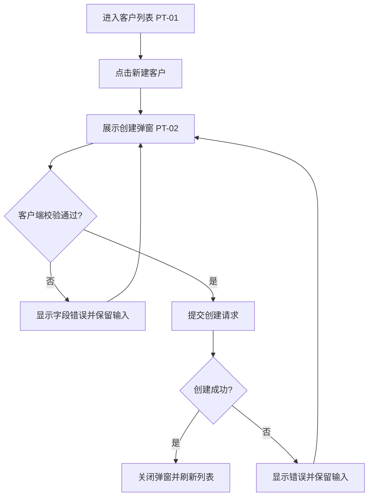
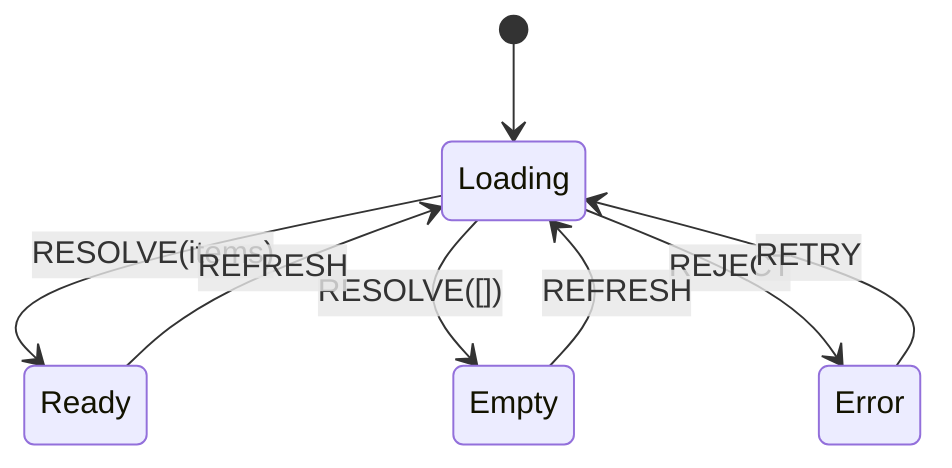
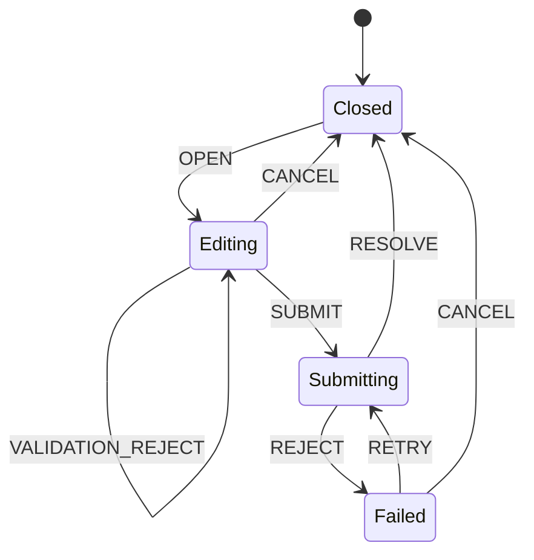
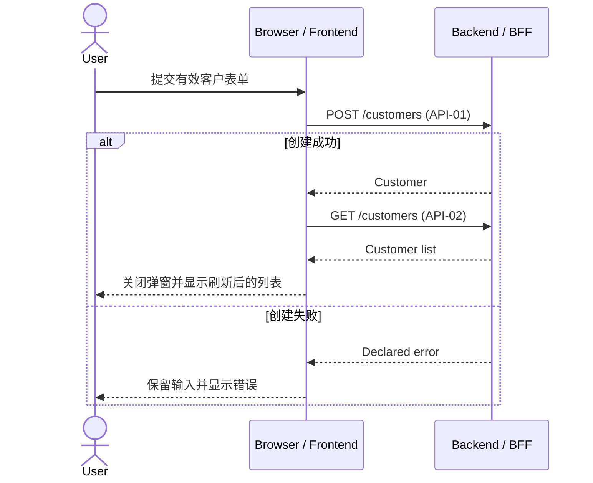

# Customer Management Frontend Development Plan（V5 节选）

Status: Ready for Technical Review

## Review Source

- Feishu Document: `https://example.feishu.cn/docx/customer-plan`
- Feishu Revision: `42`
- Synced At: `2026-08-10T16:20:00+08:00`
- Export Mode: `cloud-media`

## 1. Review 导读

本方案供产品、前端、后端和测试共同确认客户列表与新增客户的业务范围、原型状态、API 调用和验收条件。Reviewer 不需要访问生成会话即可理解本方案。

## 2. 功能背景与问题

当前客户信息依赖线下维护。本期提供客户列表和新建入口，使运营人员可以查询并录入客户。

## 3. 目标用户与使用场景

- 目标用户：具有客户管理权限的运营人员。
- 场景：进入列表查看客户，从列表打开创建弹窗并提交新客户。

## 4. 输入资料与版本

| Source ID | Type | Title / Scope | Version | Open / Download | Original Locator |
| --- | --- | --- | --- | --- | --- |
| [PRD-01](https://example.feishu.cn/docx/customer-plan#prd01-file) | PRD | [客户列表与新增](https://example.feishu.cn/docx/customer-plan#prd01-file) | v3 | [查看/下载原文件](https://example.feishu.cn/docx/customer-plan#prd01-file) | `requirements/customer-management.md` |
| [PT-01](https://example.feishu.cn/docx/customer-plan?block_id=pt01-image)、[PT-02](https://example.feishu.cn/docx/customer-plan?block_id=pt02-image) | Prototype | 列表与创建弹窗 | Captured nodes 12:34、12:56 | [查看飞书原型 Blocks](https://example.feishu.cn/docx/customer-plan?block_id=pt01-image) | Figma nodes 12:34、12:56 |
| [API-01](https://example.feishu.cn/docx/customer-plan#api-file)、[API-02](https://example.feishu.cn/docx/customer-plan#api-file) | API | [创建与查询](https://example.feishu.cn/docx/customer-plan#api-file) | Customer API v2 | [查看/下载 OpenAPI](https://example.feishu.cn/docx/customer-plan#api-file) | `openapi/customer-v2.yaml` |

## 5. 原型页面与状态总览

| Prototype ID | Page / State | Preview / Block Link | Original Source | What It Proves | Related Flow / State |
| --- | --- | --- | --- | --- | --- |
| [PT-01](https://example.feishu.cn/docx/customer-plan?block_id=pt01-image) | 客户列表默认状态 | [查看原型图片](https://example.feishu.cn/docx/customer-plan?block_id=pt01-image) | Figma node 12:34 | 搜索区、表格和新增入口 | [UF-01](https://example.feishu.cn/docx/customer-plan?block_id=uf01-diagram)、[SM-01](https://example.feishu.cn/docx/customer-plan?block_id=sm01-diagram) |
| [PT-02](https://example.feishu.cn/docx/customer-plan?block_id=pt02-image) | 新建客户弹窗 | [查看原型图片](https://example.feishu.cn/docx/customer-plan?block_id=pt02-image) | Figma node 12:56 | 字段、提交和取消操作 | [UF-01](https://example.feishu.cn/docx/customer-plan?block_id=uf01-diagram)、[SM-02](https://example.feishu.cn/docx/customer-plan?block_id=sm02-diagram) |

## 6. 本次开发范围与非目标

- 范围内：列表加载、空态、错误态、新建客户和创建后刷新。
- 非目标：批量删除（CL-01）。

## 7. 页面与组件职责

```text
CustomerPage
├── CustomerSearchArea
├── CustomerTable
└── CustomerCreateDialog
```

## 8. User Flow

### UF-01 新建客户

运营人员从客户列表打开新建弹窗，填写有效信息后提交；成功后关闭弹窗并刷新列表，失败时保留输入并展示可重试错误。



- Evidence / Decisions: [PRD-01](https://example.feishu.cn/docx/customer-plan#prd01-file)、[PT-01](https://example.feishu.cn/docx/customer-plan?block_id=pt01-image)、[PT-02](https://example.feishu.cn/docx/customer-plan?block_id=pt02-image)、CL-03、CL-04。

## 9. 前端状态设计

| 状态域 | 数据/状态 | 所有者 | 初始值 | 变化事件 | 重置条件 | State ID |
| --- | --- | --- | --- | --- | --- | --- |
| 客户列表 | customers、loading、error | CustomerPage | idle | LOAD、RESOLVE、REJECT | 离开页面 | [SM-01](https://example.feishu.cn/docx/customer-plan?block_id=sm01-diagram) |
| 创建弹窗 | opened、form、submitting、error | Dialog | closed | OPEN、SUBMIT、RESOLVE、REJECT | 成功或取消 | [SM-02](https://example.feishu.cn/docx/customer-plan?block_id=sm02-diagram) |

### SM-01 客户列表

列表负责加载、成功、空态和可重试错误；创建成功触发刷新，离开页面后重置瞬时请求状态。



- Related Flows / Evidence: [UF-01](https://example.feishu.cn/docx/customer-plan?block_id=uf01-diagram)、[PT-01](https://example.feishu.cn/docx/customer-plan?block_id=pt01-image)、CL-04。

### SM-02 创建弹窗

弹窗在提交失败后保留表单，提交期间禁止重复提交，成功或取消时清理瞬时表单状态。



- Related Flows / Evidence: [UF-01](https://example.feishu.cn/docx/customer-plan?block_id=uf01-diagram)、[PT-02](https://example.feishu.cn/docx/customer-plan?block_id=pt02-image)、CL-03。

## 10. API 使用方案

| 场景 | API ID | Method / Path | 触发时机 | 请求摘要 | 成功处理 | 失败处理 | Sequence |
| --- | --- | --- | --- | --- | --- | --- | --- |
| 创建客户 | [API-01](https://example.feishu.cn/docx/customer-plan#api-file) | POST `/customers` | 有效提交 | `name`, `email` | 关闭并刷新 | 保留输入并显示错误 | [SQ-01](https://example.feishu.cn/docx/customer-plan?block_id=sq01-diagram) |
| 刷新列表 | [API-02](https://example.feishu.cn/docx/customer-plan#api-file) | GET `/customers` | 页面加载、创建成功 | 分页参数 | 数据或空态 | 可重试错误 | [SQ-01](https://example.feishu.cn/docx/customer-plan?block_id=sq01-diagram) |

## 11. API 与交互 Mapping

### SQ-01 创建客户并刷新列表

有效提交触发创建接口；创建成功后再刷新列表。任一请求失败都进入对应的可见错误状态，不隐藏失败或自动重试。



- Related Flow / State / API: [UF-01](https://example.feishu.cn/docx/customer-plan?block_id=uf01-diagram)、[SM-01](https://example.feishu.cn/docx/customer-plan?block_id=sm01-diagram)、[SM-02](https://example.feishu.cn/docx/customer-plan?block_id=sm02-diagram)、[API-01](https://example.feishu.cn/docx/customer-plan#api-file)、[API-02](https://example.feishu.cn/docx/customer-plan#api-file)。

## 14. 开发任务拆分

| Task ID | 任务 | 输入 | 交付物 | 依赖 | 验收标准 |
| --- | --- | --- | --- | --- | --- |
| FE-01 | 页面结构与列表状态 | [PT-01](https://example.feishu.cn/docx/customer-plan?block_id=pt01-image)、[SM-01](https://example.feishu.cn/docx/customer-plan?block_id=sm01-diagram) | 列表交互 | — | 加载、空、成功、错误可独立验收 |
| FE-02 | API 适配 | [API-01](https://example.feishu.cn/docx/customer-plan#api-file)、[API-02](https://example.feishu.cn/docx/customer-plan#api-file) | 请求/响应边界 | — | 映射符合 API v2 |
| FE-03 | 创建弹窗 | [PT-02](https://example.feishu.cn/docx/customer-plan?block_id=pt02-image)、[UF-01](https://example.feishu.cn/docx/customer-plan?block_id=uf01-diagram)、[SM-02](https://example.feishu.cn/docx/customer-plan?block_id=sm02-diagram) | 表单与反馈 | FE-02 | 成功、失败、取消和重复提交符合决策 |

## 18. 追踪矩阵

| Requirement / Source | Prototype | Clarification | User Flow | State | Sequence / API | Task |
| --- | --- | --- | --- | --- | --- | --- |
| [PRD-01](https://example.feishu.cn/docx/customer-plan#prd01-file) 新增客户 | [PT-01](https://example.feishu.cn/docx/customer-plan?block_id=pt01-image)、[PT-02](https://example.feishu.cn/docx/customer-plan?block_id=pt02-image) | CL-03、CL-04 | [UF-01](https://example.feishu.cn/docx/customer-plan?block_id=uf01-diagram) | [SM-01](https://example.feishu.cn/docx/customer-plan?block_id=sm01-diagram)、[SM-02](https://example.feishu.cn/docx/customer-plan?block_id=sm02-diagram) | [SQ-01](https://example.feishu.cn/docx/customer-plan?block_id=sq01-diagram) / [API-01](https://example.feishu.cn/docx/customer-plan#api-file)、[API-02](https://example.feishu.cn/docx/customer-plan#api-file) | FE-01～FE-03 |

## 19. Technical Review 清单

- [ ] 未参与生成会话的 Reviewer 可以理解背景、范围和原型。
- [ ] 所有证据、决策、流程、状态、API 和任务可追踪。
- [ ] 飞书 Revision 42 与本地快照一致。
