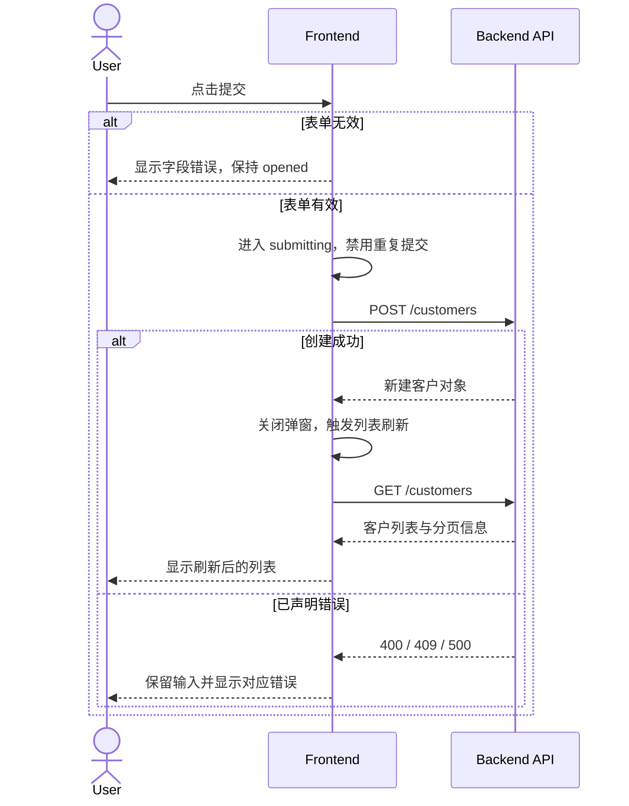

# 客户管理前后端交互时序（节选）

## API 清单

| API ID | Method | Path | 用途 | 请求摘要 | 成功响应 | 已声明错误 | 来源 |
| --- | --- | --- | --- | --- | --- | --- | --- |
| API-01 | POST | `/customers` | 创建客户 | `name`, `email` | 新建客户对象 | 400、409、500 | Customer API PRD |
| API-02 | GET | `/customers` | 查询客户列表 | 分页参数 | 客户列表与分页信息 | 500 | Customer API PRD |

## Flow / State / API 映射

| Sequence ID | Flow ID | State ID / transition | API ID | 触发动作 | 完成后的 UI 状态 |
| --- | --- | --- | --- | --- | --- |
| SQ-01 | UF-01 | SM-02 opened → submitting → closed/failed | API-01 | 提交有效表单 | 关闭弹窗或显示错误 |

## SQ-01 新增客户

## API 契约缺口

- API PRD 未定义重复提交的幂等策略；前端方案需将其标为 `API-GAP-01`，不能假定支持幂等键。

## 下游交接

- `frontend-plan-generator` 应将 API-01、API-02 及 API-GAP-01 纳入调用方案和风险清单。
