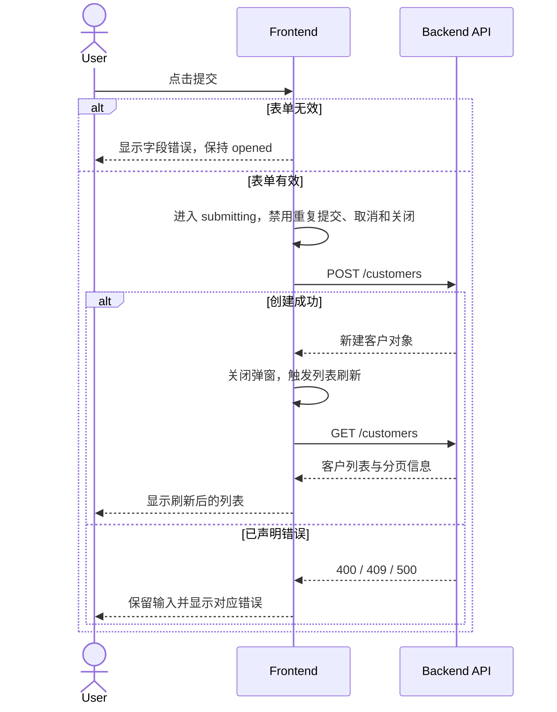

# 客户管理前后端交互时序（节选）

## 输入、覆盖范围与澄清 Gate

`clarification.md`: Status `Resolved`, Gate `PASS`；本节引用 CL-03、CL-04。

## API 清单

| API ID | Method | Path | 用途 | 请求摘要 | 成功响应 | 已声明错误 | 来源 |
| --- | --- | --- | --- | --- | --- | --- | --- |
| API-01 | POST | `/customers` | 创建客户 | `name`, `email` | 新建客户对象 | 400、409、500 | Customer API PRD |
| API-02 | GET | `/customers` | 查询客户列表 | 分页参数 | 客户列表与分页信息 | 500 | Customer API PRD |

## Flow / State / API 映射

| Sequence ID | Flow ID | State ID / transition | API ID | 触发动作 | 完成后的 UI 状态 |
| --- | --- | --- | --- | --- | --- |
| SQ-01 | UF-01 | SM-02 opened → submitting → closed/failed | API-01 | 提交有效表单 | 关闭弹窗或显示错误 |

## SQ-01 新增客户

## API 契约依据

- API-01、API-02 的 method、path、字段、响应和错误分支均来自已确认的 Customer API PRD。

## 澄清决策引用

| Sequence / branch | 来源或 CL ID | 已确认行为 |
| --- | --- | --- |
| SQ-01 / 请求进行中 | CL-03 | 禁止重复提交和自动重试，不发送幂等键 |
| SQ-01 / 请求进行中 | CL-04 | 禁止取消和关闭，等待响应后转换状态 |

## 下游交接

- 澄清 Gate 仍为 PASS；`frontend-plan-generator` 可消费 API-01、API-02 和 SQ-01。
