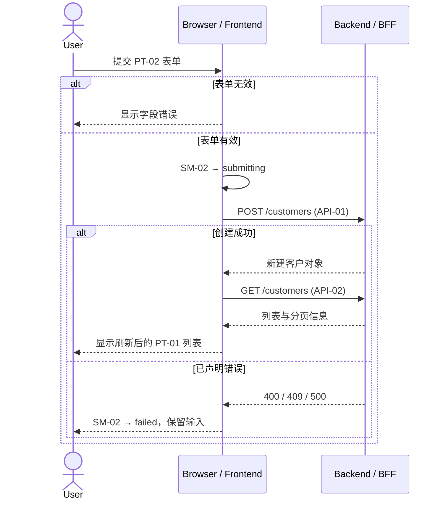

# 客户管理前后端交互时序（V5 节选）

## API 清单

| API ID | Method | Path | Purpose | Request | Success | Declared Errors | Source / Version |
| --- | --- | --- | --- | --- | --- | --- | --- |
| API-01 | POST | `/customers` | 创建客户 | `name`, `email` | 新建客户对象 | 400、409、500 | Customer API v2 |
| API-02 | GET | `/customers` | 查询客户列表 | 分页参数 | 列表与分页信息 | 500 | Customer API v2 |

## Flow / State / API 映射

| Sequence ID | Flow ID | State Transition | API ID | Trigger | Resulting UI State |
| --- | --- | --- | --- | --- | --- |
| SQ-01 | UF-01 | SM-02 opened → submitting → closed/failed | API-01、API-02 | 提交有效表单 | 刷新列表或显示错误 |

## SQ-01 新增客户

## 证据与澄清决策引用

| Sequence / Branch | Source or CL ID | Confirmed Behavior |
| --- | --- | --- |
| SQ-01 / API | API-01、API-02 | Method、path、字段和错误来自 API v2 |
| SQ-01 / 请求中 | CL-03、CL-04 | 禁止重复提交、自动重试、取消和关闭 |
