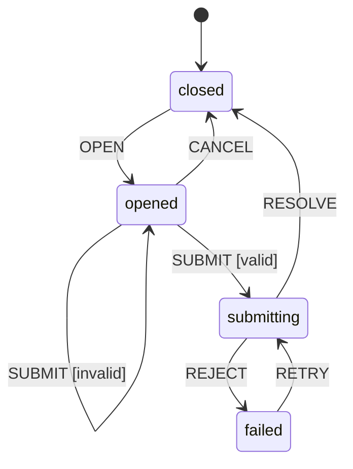

# 客户管理状态模型（节选）

## 输入、覆盖范围与澄清 Gate

`clarification.md`: Status `Resolved`, Gate `PASS`；本节引用 CL-03、CL-04。

## 状态机清单

| State ID | 页面/组件 | 关联 Flow | 初始状态 | 关键终态/恢复态 |
| --- | --- | --- | --- | --- |
| SM-01 | Customer List | UF-01 | idle | success、empty、error |
| SM-02 | Create Dialog | UF-01 | closed | opened、submitting、failed |

## SM-02 Create Dialog

| 当前状态 | 事件 | Guard | 下一状态 | 可见反馈 | 来源 |
| --- | --- | --- | --- | --- | --- |
| closed | OPEN | — | opened | 显示空白表单 | 原型 |
| opened | SUBMIT | 表单无效 | opened | 显示字段错误 | UF-01 |
| opened | SUBMIT | 表单有效 | submitting | 禁用重复提交并显示加载 | UF-01 |
| submitting | RESOLVE | — | closed | 关闭弹窗，通知列表刷新 | UF-01 |
| submitting | REJECT | — | failed | 保留输入并显示错误 | UF-01 |
| failed | RETRY | 表单有效 | submitting | 再次显示加载 | UF-01 |
| opened | CANCEL | — | closed | 关闭弹窗 | 原型 |

## 跨状态约束

- `submitting` 状态不接受 `SUBMIT`、`CANCEL` 或关闭事件（CL-03、CL-04）。
- 请求失败后保留输入并进入 `failed`；只能由用户显式 `RETRY`（CL-03）。

## 澄清决策引用

| State / transition | CL ID | 已确认决策 |
| --- | --- | --- |
| SM-02 / submitting | CL-03 | 禁止重复提交和自动重试 |
| SM-02 / submitting | CL-04 | 禁止取消和关闭 |

## 下游交接

- 澄清 Gate 仍为 PASS；`sequence-diagram-generator` 应将创建请求映射到 `SM-02.submitting → closed/failed`。
