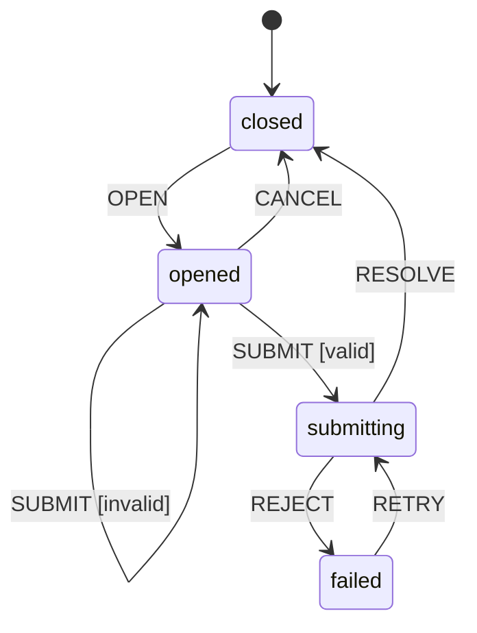

# 客户管理状态模型（V5 节选）

## 状态机清单

| State ID | 页面/组件 | Flow IDs | Prototype IDs | 初始状态 | 关键终态/恢复态 |
| --- | --- | --- | --- | --- | --- |
| SM-01 | Customer List | UF-01 | PT-01 | idle | success、empty、error |
| SM-02 | Create Dialog | UF-01 | PT-02 | closed | opened、submitting、failed |

## SM-02 Create Dialog

| 当前状态 | 事件 | Guard | 下一状态 | 可见反馈 | Source / Flow / CL |
| --- | --- | --- | --- | --- | --- |
| closed | OPEN | — | opened | 显示空白表单 | PT-01、PT-02 |
| opened | SUBMIT | 表单无效 | opened | 显示字段错误 | UF-01 |
| opened | SUBMIT | 表单有效 | submitting | 显示加载并禁用操作 | UF-01、CL-03、CL-04 |
| submitting | RESOLVE | — | closed | 关闭并刷新列表 | UF-01 |
| submitting | REJECT | — | failed | 保留输入并显示错误 | UF-01、CL-03 |
| failed | RETRY | 表单有效 | submitting | 再次显示加载 | CL-03 |
| opened | CANCEL | — | closed | 关闭弹窗 | PT-02 |

## 证据与澄清决策引用

| State / Transition | Evidence ID | Confirmed Behavior |
| --- | --- | --- |
| SM-02 / opened | PT-02 | 创建表单字段与操作可见 |
| SM-02 / submitting | CL-03、CL-04 | 禁止重复提交、取消和关闭 |
