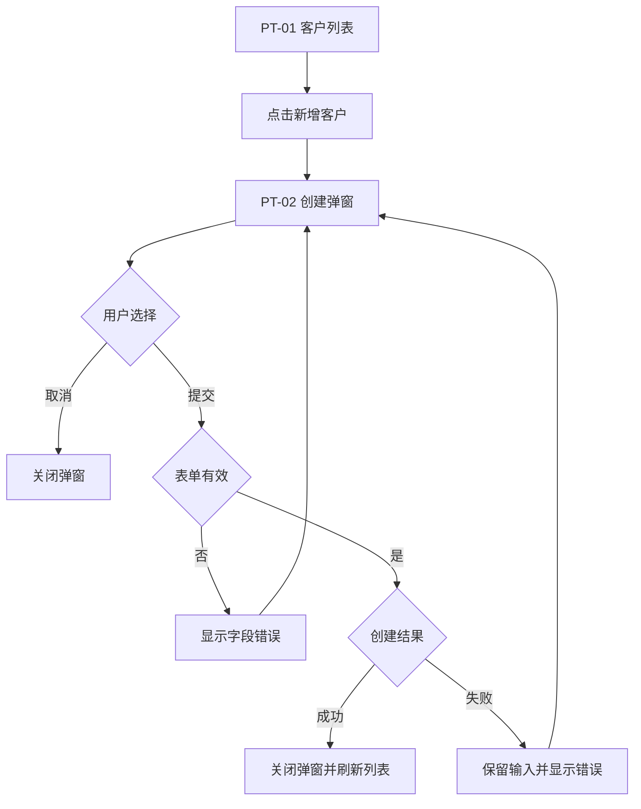

# 客户管理用户流程（V5 节选）

## 来源与 Gate 状态

- `source-manifest.md`: Source Gate `PASS`。
- `clarification.md`: Clarification Gate `PASS`。

## 页面与交互元素

| 页面/容器 | 元素 | 类型 | 支持动作 | PRD / Prototype Evidence |
| --- | --- | --- | --- | --- |
| Customer List | 新增客户 | 按钮 | click | PRD-01、PT-01 |
| Create Dialog | 名称、邮箱 | 输入框 | input | PT-02 |
| Create Dialog | 提交、取消 | 按钮 | submit、cancel | PT-02、CL-04 |

## 流程清单

| Flow ID | 用户目标 | 入口 | 成功结果 | 其他结果 | Prototype IDs |
| --- | --- | --- | --- | --- | --- |
| UF-01 | 新增客户 | Customer List | 新客户出现在列表 | 取消、校验失败、提交失败 | PT-01、PT-02 |

## UF-01 新增客户

1. 用户在 PT-01 客户列表点击“新增客户”。
2. 页面展示 PT-02 创建弹窗。
3. 用户填写并提交；无效输入显示字段错误。
4. 创建成功后关闭弹窗并刷新列表；失败时保留输入并显示错误。

## 证据与澄清决策引用

| Flow ID / Step | Source or CL ID | Confirmed Behavior |
| --- | --- | --- |
| UF-01 / 页面与弹窗 | PT-01、PT-02 | 列表入口和创建表单可见 |
| UF-01 / 提交中 | CL-03、CL-04 | 禁止重复提交、取消和关闭 |
