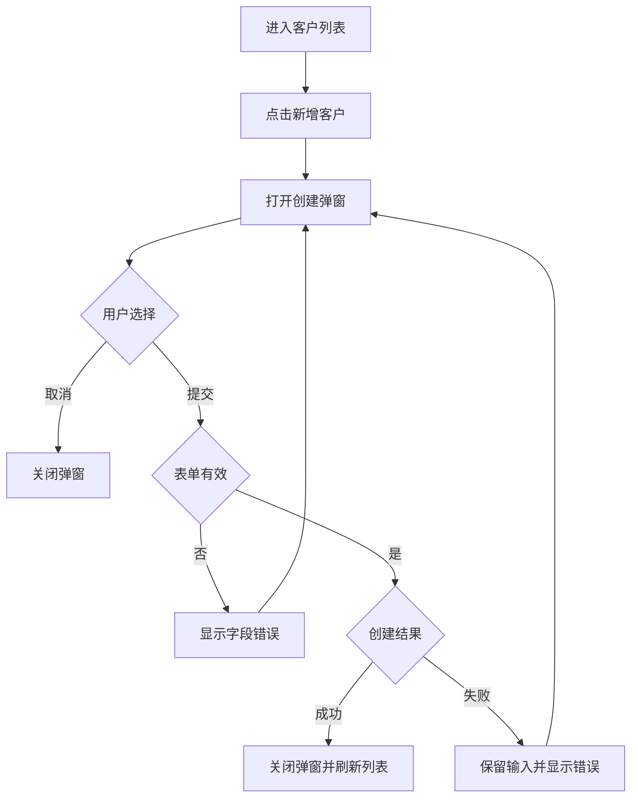

# 客户管理用户流程（节选）

## 范围与来源

| 来源 | 定位 | 已确认信息 |
| --- | --- | --- |
| 客户管理 PRD | 新增客户 | 用户可从列表页创建客户 |
| 客户管理原型 | Customer List / Create Dialog | 列表页含“新增客户”，弹窗含名称、邮箱、提交、取消 |

## 页面与交互元素

| 页面/容器 | 元素 | 类型 | 支持的动作 | 来源 |
| --- | --- | --- | --- | --- |
| Customer List | 新增客户 | 按钮 | click | 原型 |
| Create Dialog | 名称、邮箱 | 输入框 | input | 原型 |
| Create Dialog | 提交、取消 | 按钮 | submit、cancel | 原型 |

## 流程清单

| Flow ID | 用户目标 | 入口 | 成功结果 | 其他结果 |
| --- | --- | --- | --- | --- |
| UF-01 | 新增客户 | Customer List | 新客户出现在列表 | 取消、校验失败、提交失败 |

## UF-01 新增客户

1. 用户进入客户列表。
2. 用户点击“新增客户”。
3. 页面打开创建弹窗。
4. 用户填写名称和邮箱并提交。
5. 页面校验输入；通过后发起创建。
6. 创建成功后关闭弹窗并刷新列表；失败时保留输入并显示错误。

## 待确认项

- 创建成功后是否定位或高亮新客户，PRD 与原型均未说明。

## 下游交接

- `state-machine-generator` 可基于 UF-01 建模列表加载状态与创建弹窗状态。
