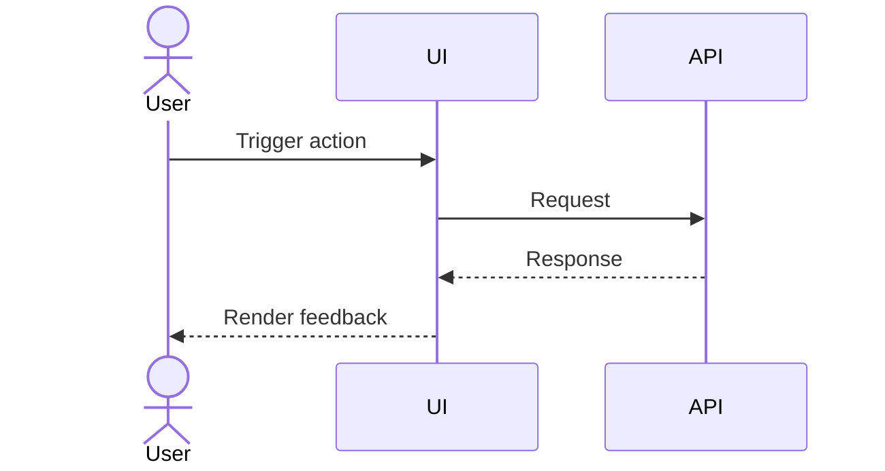

# Sequence Diagrams

## Flow title

Mapped IDs: `RQ-`, `UI-`, `API-`, `IX-`

```mermaid
sequenceDiagram
    actor User
    participant UI
    participant API
    User->>UI: Trigger action
    UI->>API: Request
    API-->>UI: Response
    UI-->>User: Render feedback
```
