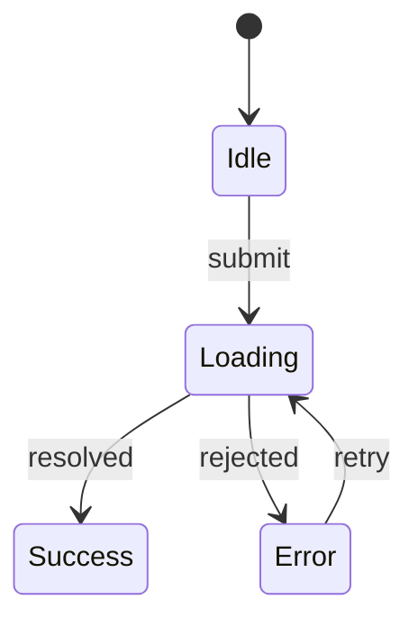

# State Models

## Page or component

Mapped interaction IDs: `IX-`

```mermaid
stateDiagram-v2
    [*] --> Idle
    Idle --> Loading: submit
    Loading --> Success: resolved
    Loading --> Error: rejected
    Error --> Loading: retry
```
